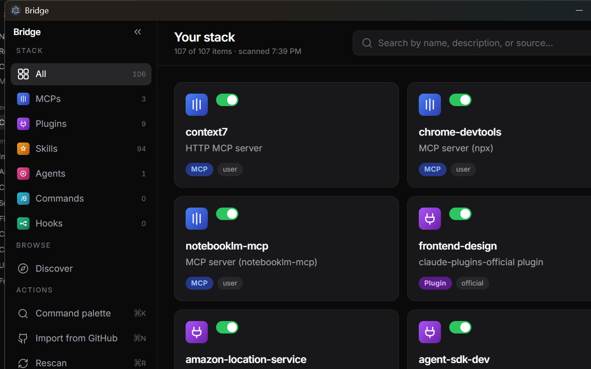
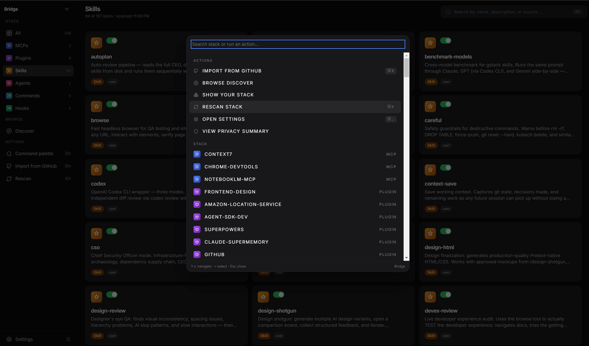
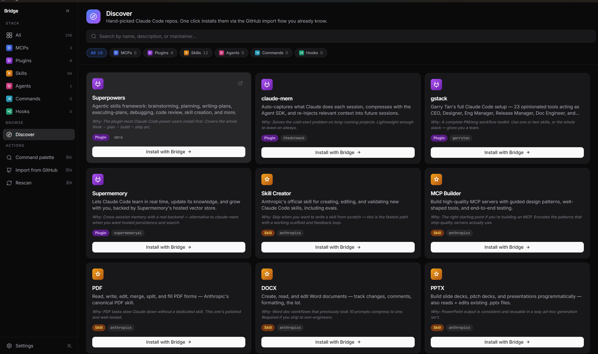
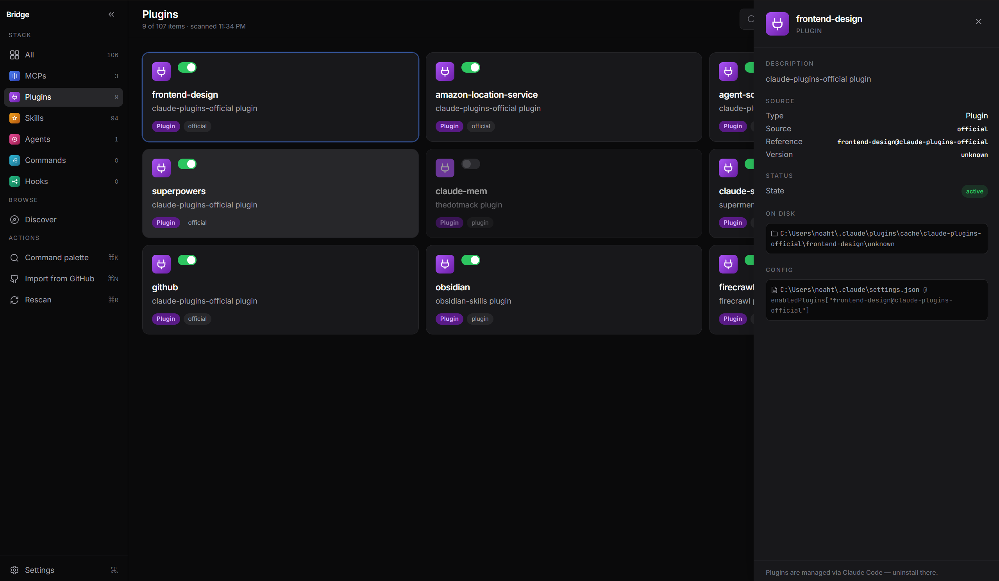
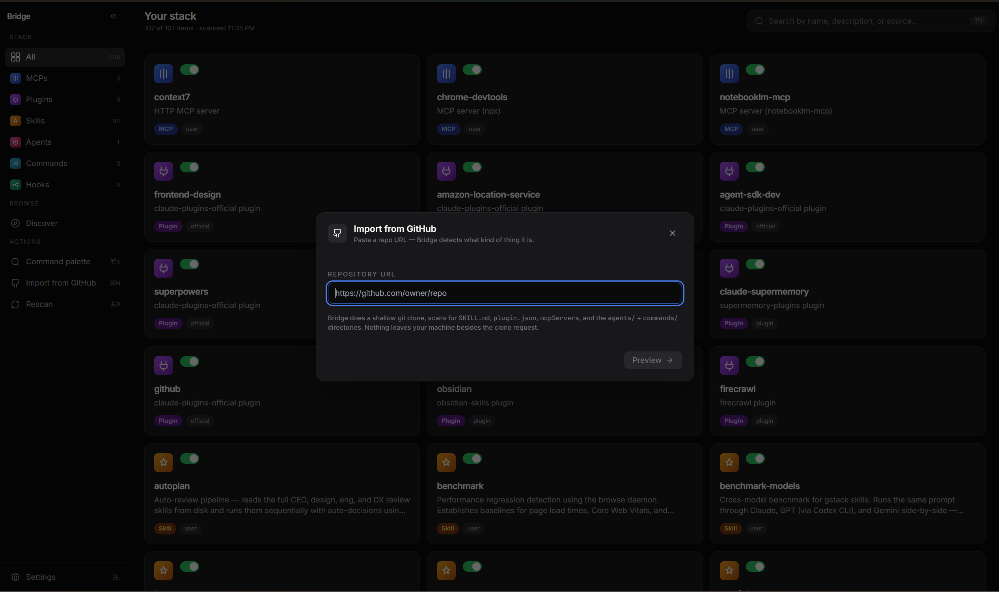
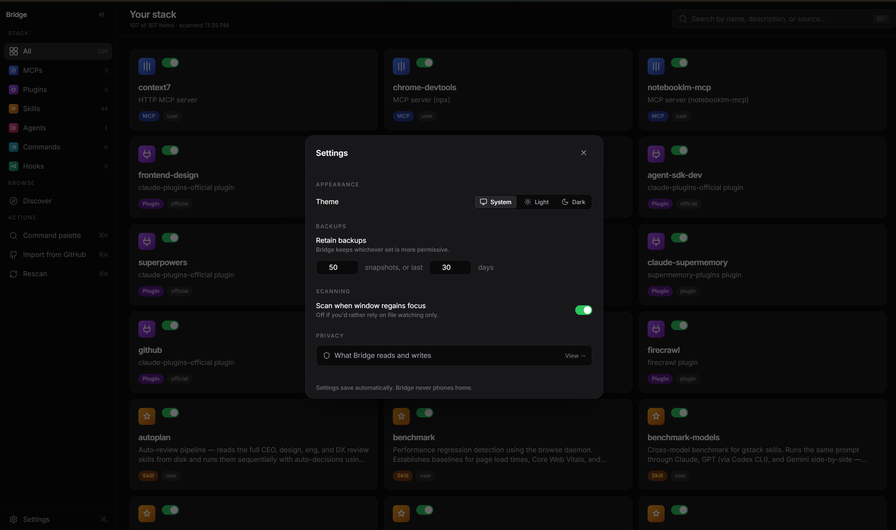

<div align="center">

# Bridge

**The OS for Claude Code.**

A visual dashboard for your MCPs, Skills, Agents, Plugins, slash commands, and hooks.

[](LICENSE)
[](https://github.com/noahtekle/bridge/releases)
[](https://bridge-stack.pages.dev)

</div>



---

## What is Bridge?

Claude Code's power-user surface is scattered across `~/.claude.json`, `~/.claude/settings.json`, and folders for skills, agents, slash commands, and hooks. There's no native UI for any of it. You manage your stack by hand-editing config.

Bridge is the missing GUI layer.

- See every MCP, Skill, Agent, Plugin, slash command, and hook on one dashboard
- Toggle on/off, edit descriptions, delete with a backup kept
- Import skills/agents/plugins straight from a GitHub URL — Bridge detects what kind of thing it is and previews what will be written before installing
- Discover tab with hand-picked, verified-URL plugins and skills — one-click install via the same flow
- Linear/Raycast/Arc-inspired interface, dark mode default, system theme sync
- Local-only — your config never leaves your machine

## Screenshots

### Command palette


### Discover tab


### Card detail


### GitHub import


### Settings


## Download

**Bridge is unsigned for v0.1.** First launch on each platform shows a security warning — see [bypass instructions](#why-is-this-unsigned) below.

| Platform | Download |
|---|---|
| macOS (Apple Silicon + Intel) | [Latest release](https://github.com/noahtekle/bridge/releases/latest) |
| Windows (x64) | [Latest release](https://github.com/noahtekle/bridge/releases/latest) |

Or build from source:

```bash
git clone https://github.com/noahtekle/bridge.git
cd bridge
pnpm install
pnpm dev
```

## Why is this unsigned?

Bridge is open source. Every write is backed up first. There are no outbound network calls except when you explicitly trigger a GitHub import. You can read the source before you run it.

Signing adds a layer of OS-level trust on top of that. It's on the roadmap for a future release. For v0.1, the safety case stands on its own — public source, atomic backed-up writes, zero telemetry. Once you approve the app on first launch, your OS remembers and never warns again.

### macOS — first launch

The default Open will say _"Bridge can't be opened because it is from an unidentified developer."_

**Bypass:**

1. Locate `Bridge.app` in your Applications folder
2. **Right-click → Open** (don't double-click)
3. Click **Open** in the confirmation dialog
4. macOS remembers the choice; future launches are normal

### Windows — first launch

SmartScreen Defender will show _"Windows protected your PC."_

**Bypass:**

1. Click **More info** in the SmartScreen dialog
2. Click **Run anyway**
3. Windows remembers the choice; future launches are normal

## Privacy

**Bridge reads your Claude Code config locally and never phones home.**

No telemetry. No analytics. No crash reporting. No accounts. No cloud. Zero outbound network calls except when you explicitly trigger a GitHub import. This is a contract — anything that violates it is a bug.

Backups of your config are written to `~/.claude/backups/<timestamp>/` before any mutation, and rotated automatically (last 50 OR last 30 days, whichever is more permissive). Atomic JSON writes (`.tmp` + `fsync` + `rename`) so a process crash mid-write can't corrupt the original.

Settings live in Bridge's own dir at `<userData>/bridge-settings.json` — never polluted into your `~/.claude/`.

## Features (v0.1)

- ✅ Six categories: MCPs, Skills, Agents, Plugins, slash commands, hooks
- ✅ Read pipeline scans `~/.claude.json` + `~/.claude/`, picks up plugin-bundled items too
- ✅ FileWatcher (chokidar) — external edits update the dashboard within ~1s
- ✅ Toggle, edit description, delete — every mutation backed up first, atomic
- ✅ Restart-needed banner when MCP/plugin changes require a Claude Code restart
- ✅ GitHub import: paste URL → clone → detect → preview → install (with monorepo subPath support)
- ✅ Discover tab: 16 hand-curated plugins and skills, one-click install via the import flow
- ✅ Cmd-K command palette: search stack + actions + quick toggles + quick deletes
- ✅ Settings: theme (system/light/dark), backup retention, scan-on-focus
- ✅ Privacy modal: first-run + linked from Settings
- ✅ "Claude Code not detected" first-run fallback if `~/.claude/` is missing
- ✅ Hotkeys: Cmd-K palette, Cmd-, settings, Cmd-N new (import), Cmd-R rescan, Cmd-F search, Esc close
- ✅ Cross-platform: Mac (Apple Silicon + Intel) and Windows (x64)

## Roadmap

Deferred from v0.1, ordered by likely landing:

- **MCP install path** — read MCP server READMEs, generate `mcpServers` JSON, append to `~/.claude.json` (unlocks ~10 more Discover entries)
- **Code signing + notarization** — Mac and Windows
- **Plugin install via Bridge** — currently routes to Claude Code's CLI hint; native install support
- **Right-click context menus** on cards
- **Drag-and-drop folder import**
- **Backup diff viewer** with one-click restore
- **Marketplace + share-as-link** — community-contributed setups
- **Cloud sync** (paid tier) — sync your stack across machines

## Architecture

- **Stack:** Electron 32 + Vite + electron-vite + electron-builder, React 18 + TypeScript, Tailwind + shadcn-style components, Lucide, Framer Motion, Zustand
- **Repo layout:** pnpm workspaces — `apps/desktop` (Electron app), `apps/web` (marketing site at `bridge-stack.pages.dev`), `packages/core` (shared types + IPC contract), `packages/ui` (design tokens)
- **Security from commit 1:** `contextIsolation: true`, `nodeIntegration: false`, `sandbox: true`. Renderer ↔ main only via the typed IPC contract at `packages/core/src/ipc.ts`. Filesystem access lives in main; renderer never touches disk.
- **Tests:** 58 vitest tests covering ConfigWriter (toggle/delete/edit per category, queue serialization), backup snapshot + rotation, hook scanner + writer, GitHub-import detection, monorepo subPath traversal safety. Real `~/.claude/` never touched — tests run against `BRIDGE_CLAUDE_HOME` tmp dir.

See [`CHANGELOG.md`](CHANGELOG.md) for the per-week build log.

## Contributing

PRs welcome. The most useful contribution today: add an entry to the Discover list — see [`apps/desktop/src/main/discover/README.md`](apps/desktop/src/main/discover/README.md). Five-line PR.

Issues and feature requests anytime — see [`.github/ISSUE_TEMPLATE/`](.github/ISSUE_TEMPLATE/).

## License

MIT — see [LICENSE](LICENSE). Built by [@noahtekle](https://github.com/noahtekle).
